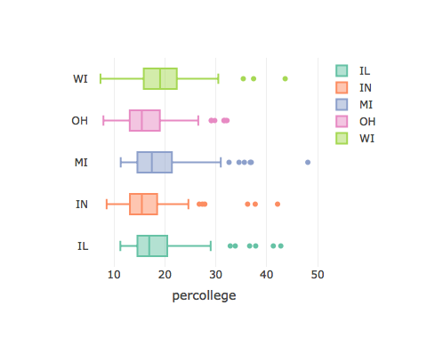

<!-- README.md is generated from README.Rmd. Please edit that file -->

# widgetdown

[](https://travis-ci.org/jayhesselberth/widgetdown)

The goal of widgetdown is to test the use of htmlwidgets in a pkgdown
website, without bloating the
[pkgdown](https://github.com/r-lib/pkgdown) package itself.

Install the development version from [GitHub](https://github.com/) with:

``` r
# install.packages("devtools")
devtools::install_github("jayhesselberth/widgetdown")
```

## Widgets in pkgdown sections

The package tests the use of htmlwidgets in pkgdown:

  - [Home page](https://jayhesselberth.github.io/widgetdown/index.html)
    (i.e., `README.Rmd` or `index.Rmd`)
  - [Reference
    topics](https://jayhesselberth.github.io/widgetdown/reference/test-widgets.html)
    using Rd
    `@examples`.
  - [Vignettes](https://jayhesselberth.github.io/widgetdown/articles/widgetdown.html)

widgetdown tests several widgets [available from
RStudio](https://www.htmlwidgets.org/showcase_leaflet.html).

### leaflet

``` r
library(leaflet)
  leaflet() %>%
  addTiles() %>%
  addMarkers(
  lng=174.768,
  lat=-36.852,
  popup="The birthplace of R"
)
```


### heatmaply

``` r
library(heatmaply)
#> Loading required package: plotly
#> Loading required package: ggplot2
#> 
#> Attaching package: 'plotly'
#> The following object is masked from 'package:ggplot2':
#> 
#>     last_plot
#> The following object is masked from 'package:stats':
#> 
#>     filter
#> The following object is masked from 'package:graphics':
#> 
#>     layout
#> Loading required package: viridis
#> Loading required package: viridisLite
#> 
#> ======================
#> Welcome to heatmaply version 0.14.1
#> 
#> Type citation('heatmaply') for how to cite the package.
#> Type ?heatmaply for the main documentation.
#> 
#> The github page is: https://github.com/talgalili/heatmaply/
#> Please submit your suggestions and bug-reports at: https://github.com/talgalili/heatmaply/issues
#> Or contact: <tal.galili@gmail.com>
#> ======================
heatmaply(mtcars, k_row = 3, k_col = 2)
```


### plotly

``` r
library(plotly)
plot_ly(midwest,
  x = ~percollege,
  color = ~state,
  type = "box"
)
```



### DiagrammeR

``` r
library(DiagrammeR)
grViz("
  digraph {
    layout = twopi
    node [shape = circle]
    A -> {B C D} 
  }")
```


### Dygraphs

``` r
library(dygraphs)
dygraph(nhtemp, main = "New Haven Temperatures") %>% 
  dyRangeSelector(dateWindow = c("1920-01-01", "1960-01-01"))
```


### networkD3

``` r
library(networkD3)
data(MisLinks, MisNodes)
forceNetwork(Links = MisLinks, Nodes = MisNodes, Source = "source",
             Target = "target", Value = "value", NodeID = "name",
             Group = "group", opacity = 0.4)
```


### rbokeh

``` r
library(rbokeh)
figure() %>%
  ly_points(Sepal.Length, Sepal.Width, data = iris,
    color = Species, glyph = Species,
    hover = list(Sepal.Length, Sepal.Width))
```


### highcharter

``` r
library(magrittr)
library(highcharter)
#> Highcharts (www.highcharts.com) is a Highsoft software product which is
#> not free for commercial and Governmental use
#> 
#> Attaching package: 'highcharter'
#> The following object is masked from 'package:networkD3':
#> 
#>     JS
highchart() %>% 
  hc_title(text = "Scatter chart with size and color") %>% 
  hc_add_series_scatter(mtcars$wt, mtcars$mpg,
                        mtcars$drat, mtcars$hp)
#> Warning: 'hc_add_series_scatter' is deprecated.
#> Use 'hc_add_series' instead.
#> See help("Deprecated")
```


